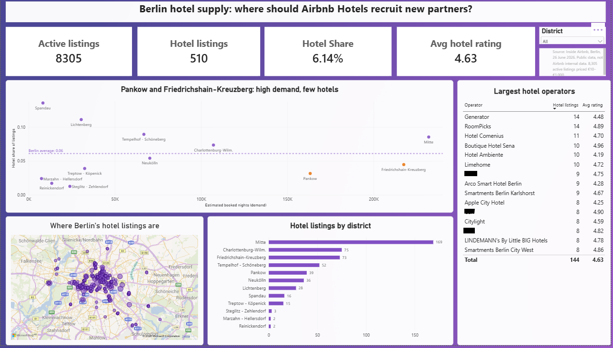

# Berlin Hotel Supply Analysis

**Where should Airbnb Hotels recruit new hotel partners in Berlin?**

## The question
I put myself in the shoes of an analyst on Airbnb's Hotels team and asked: where in Berlin do guests want to stay, but have few hotels to choose from?

## Data
Public data from [Inside Airbnb](https://insideairbnb.com/get-the-data/), Berlin, 26 June 2026. This is not Airbnb's internal data. I haven't included the raw data here because it contains personal details, but you can download it from the source.

## Tools
Excel Power Query · SQL (SQLite) · Power BI

## What I did
- Cleaned about 15,000 listings in Power Query: fixed prices, removed unpriced and extreme listings, and grouped listings into hotels, hostels, apartments and rooms
- Wrote SQL queries on market size, hotel supply by district, demand versus supply, price per guest and hotel operators
- Built a one-page Power BI dashboard with measures, Top N filters and an opportunity chart
- Wrote a one-page recommendation memo

## What I found
- Hotels make up only 6.1% of Berlin's 8,305 active listings
- Pankow and Friedrichshain-Kreuzberg get almost 40% of guest demand but have only about a fifth of the hotel listings
- Friedrichshain-Kreuzberg already has well-known hotels on Airbnb that list just one room type, while Pankow has no hotel chains at all
- The market is fragmented: the 15 biggest operators hold only 28% of hotel listings

## What I recommend
Grow the hotels already on Airbnb in Friedrichshain-Kreuzberg, recruit new independent hotels in Pankow, and help lower-rated hotels improve their listings. The full reasoning is in [the memo](Berlin_Hotel_Memo.pdf).

## Files
- `queries.sql`: all SQL queries
- `Berlin_Hotel_Memo.pdf`: one-page recommendation
- `dashboard_public.png`: the dashboard (private host names hidden)
- `power_query_steps.png`: data cleaning steps
